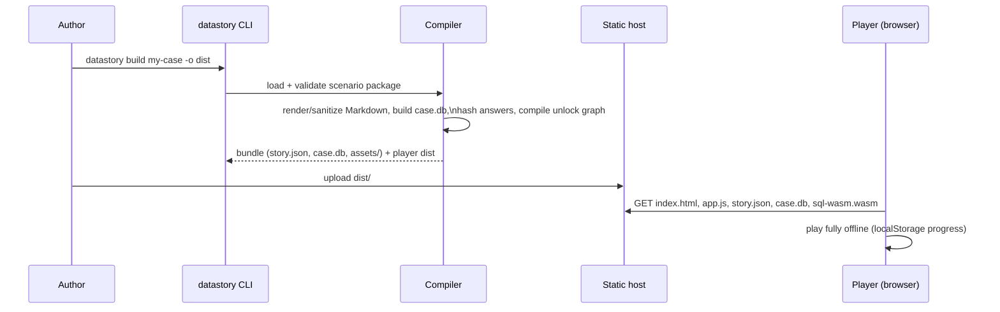

# datastory-kit — v1 Design

Status: Draft for review · Date: 2026-07-10 · Owners: product owner + design agent

This document is the **canonical source of truth** for v1 requirements and design.
GitHub Issues are derived from [ISSUE_PLAN.md](./ISSUE_PLAN.md) and [issues/](./issues/), which in turn derive from this document. If artifacts disagree, fix this document first.

Architecture decisions with context and alternatives live in [decisions/](./decisions/) (ADR-001 … ADR-007). This document states the *what*; ADRs preserve the *why*.

---

## 1. Product overview

**datastory-kit** is an open-source toolkit for building and playing *narrative investigation learning materials* in the lineage of [SQL Murder Mystery](https://mystery.knightlab.com/) — but generalized beyond SQL: learners solve a story-driven mystery by cross-examining documents, images, tabular data (via SQL **or** a no-code table browser), and character interviews.

Two halves, one repository (ADR-002):

- **Authoring/build half** (`datastory` CLI + compiler): authors write a *scenario package* — a directory of YAML, Markdown, and CSV files (§5, ADR-005) — and compile it into a self-contained static web site.
- **Play half** (player runtime): a React single-page app (ADR-004) that runs entirely in the learner's browser (ADR-001) — no server, no network calls, offline-capable, progress in `localStorage`.

One sentence per audience:

- For a **teacher/creator**: "Write story files and CSV data, run one command, get a mystery-solving website you can put on GitHub Pages."
- For a **learner**: "Read the case, dig through the evidence, question the suspects, and prove who did it."

### 1.1 Fixed product decisions (from the 2026-07-10 requirements interview)

| # | Topic | Decision |
|---|---|---|
| 1 | Product shape | Authoring + runtime toolkit (not runtime-only, not LLM generator) |
| 2 | Domain | General inquiry learning; SQL is one investigation mode among several |
| 3 | Runtime | Browser-only static site (ADR-001) |
| 4 | Authoring | Hand-written declarative format; engine is LLM-free and deterministic (ADR-005) |
| 5 | Investigation modes (v1) | Document reading, image evidence, SQL console, GUI table browser, character interviews |
| 6 | Mechanics (v1) | Chapter/gate progression, intermediate questions, final accusation with auto-judging, tiered hints, localStorage progress |
| 7 | Stack | TypeScript throughout (ADR-002) |
| 8 | Primary audience | School education (elementary–high school); non-violent sample material; engineer/data-learner use remains supported |
| 9 | Languages | Player chrome bilingual ja/en; sample scenario shipped in both ja and en (ADR-006) |
| 10 | License | MIT |

---

## 2. Personas and user journeys

### 2.1 Personas

| Persona | Description | Skills assumed |
|---|---|---|
| **Author** | Teacher, educational content creator, or engineer (possibly assisted by their own AI tools) who writes a scenario | Text editor, files/folders, can run one CLI command; git optional |
| **Learner** | Student (upper elementary – high school) or adult learner playing the material | Browser use; SQL **not** assumed (table browser exists for that) |
| **Deployer** | Teacher or school IT staff hosting the built material | Can upload files to static hosting or run `datastory preview` locally |
| **Contributor** | OSS developer improving the toolkit | TypeScript |

### 2.2 Author journey (happy path)

1. `pnpm dlx @datastory/cli init my-case --locale ja` → scaffolded scenario package with commented templates.
2. Edit `scenario.yaml`, chapters, evidence, CSVs, characters, questions.
3. `datastory validate my-case` → precise, file/line-anchored diagnostics (§11).
4. `datastory build my-case -o dist` → static site.
5. `datastory preview dist` → play-test locally at `http://127.0.0.1:4173`.
6. Upload `dist/` to GitHub Pages / LMS static hosting (deployment guide).

### 2.3 Learner journey (happy path)

1. Open the URL. Title screen → content warnings (if any) → chapter 1 story text.
2. Investigate: read documents, view images, query tables (SQL console or table browser), interview characters.
3. Answer the chapter's gate questions; correct answers unlock the next chapter and new evidence (with "new" notifications).
4. Stuck → open tiered hints, one small nudge at a time.
5. Final chapter → submit the accusation; on success, epilogue chapter unlocks; wrong answers get gentle retry messaging.
6. Close the tab anytime; progress restores on return (same browser/device).

---

## 3. Scope

### 3.1 v1 goals

- G1. Scenario package format (§5) fully specified, validated by `@datastory/schema` with editor-usable JSON Schema export.
- G2. Deterministic compiler (§6): scenario package → static bundle; plaintext answers never in output (ADR-007).
- G3. CLI: `init`, `validate`, `build`, `preview` (§10).
- G4. Player with five investigation surfaces (§9.3–§9.7) and full mechanics (§7, §8, §9.8).
- G5. Bilingual player chrome (ja/en) with runtime switcher (§12).
- G6. One complete sample scenario, "The Missing First Edition", in ja and en (§16).
- G7. Security model implemented and verified (§13, §14): sanitization, CSP, hardened compiler, no-network runtime.
- G8. CI-tested (unit + integration + E2E playthroughs of both sample locales), MIT-licensed, npm-published packages.

### 3.2 v1 non-goals

- No LLM anywhere in the engine (generation assistance is v2).
- No server components, telemetry, accounts, or cross-device sync.
- No authoring GUI; authoring is text files + CLI.
- No dialogue-triggered unlocks: interviews are informational; **all** unlock flow goes through chapters/questions (deliberate simplification; v2 candidate).
- No inline images inside Markdown prose; images are first-class evidence items only (§5.4, sanitizer strips ``).
- No scoring, grading, SCORM/xAPI export.
- No mobile-phone-first layout; target is desktop/tablet ≥768px wide, phones best-effort (§9.1).

### 3.3 Deferred to v2 (recorded, not designed here)

Investigation notebook/pinboard · LLM scenario-generation assistant · dialogue-triggered unlocks · audio/video/map evidence · teacher dashboard & analytics · `.dstory` zip distribution · authoring GUI · translation-sync tooling · sealed-epilogue cryptographic gating · URL deep links · progress export/import · additional locales · Japanese translation of developer docs.

### 3.4 Known unknowns (may spawn issues during implementation)

| # | Unknown | Current mitigation plan |
|---|---|---|
| U1 | sql.js WASM loading quirks across school-managed browsers (Safari memory caps, MIME strictness) | Preview server sets correct `application/wasm`; E2E on WebKit; fallback docs |
| U2 | `localStorage` quota/eviction policies on managed Chromebooks | Progress payload kept < 64 KB; in-memory fallback + warning banner (§7.4) |
| U3 | Tolerance of Japanese name matching (kanji vs readings) in text answers | Authors list accepted variants incl. kana readings; normalization spec §8; sample scenario exercises this |
| U4 | Whether teachers need print/PDF export of story text | Out of v1; collect feedback |
| U5 | Vite base-path behavior for deeply nested static hosting | `--base-path` build flag (§10.4); E2E test with non-root base |

---

## 4. System architecture

### 4.1 Repository layout

```
datastory-kit/
├── docs/                      # this design, issue plan, ADRs, guides
├── packages/
│   ├── schema/                # @datastory/schema  — Zod schemas, TS types, JSON Schema export, answer normalizer
│   ├── compiler/              # @datastory/compiler — scenario package → bundle (Node)
│   ├── player/                # @datastory/player  — React SPA; publishes prebuilt dist/
│   └── cli/                   # @datastory/cli     — bin "datastory": init/validate/build/preview
├── examples/
│   ├── school-library-case-ja/
│   └── school-library-case-en/
├── e2e/                       # Playwright tests (workspace package, not published)
├── .github/workflows/
├── pnpm-workspace.yaml
├── LICENSE                    # MIT
└── README.md
```

Dependency direction (compile-time): `cli → compiler → schema`; `player → schema` (types + normalizer only). `player` never imports `compiler`; `schema` imports nothing internal and does no I/O.

### 4.2 Data flow



### 4.3 Player runtime architecture

```
┌────────────────────────────── browser ──────────────────────────────┐
│  React app (main thread)                                            │
│  ├── BundleLoader        fetch + validate story.json (§6.2)          │
│  ├── GatingEngine        pure TS module (§7) ── Zustand store        │
│  ├── ProgressPersistence localStorage adapter (§7.4)                 │
│  ├── I18nProvider        chrome catalogs ja/en (§12)                 │
│  └── Views: ChapterReader / EvidenceBrowser / SqlConsole /           │
│             TableBrowser / Interviews / Questions / Ending (§9)      │
│                    │ postMessage protocol (§9.4.3)                   │
│  Web Worker: sql.js + case.db copy (timeout, row caps — §13.4)       │
└──────────────────────────────────────────────────────────────────────┘
```

---

## 5. Scenario package format (authoring format)

Normative for issues 04–11 (schema) and 12–18 (compiler). All files UTF-8, LF. YAML 1.2 core schema, safe parsing only (§13.5).

### 5.1 Directory layout

```
my-case/
├── scenario.yaml            # manifest (required)
├── chapters/                # ≥1 chapter (required)
│   ├── 01-prologue.md
│   └── 02-investigation.md
├── evidence/
│   ├── docs/                # document evidence: *.md (optional)
│   ├── images/              # image files (optional)
│   └── images.yaml          # image evidence metadata (required iff images/ non-empty)
├── data/
│   ├── tables/              # *.csv (optional)
│   └── datapack.yaml        # table definitions (required iff tables/ non-empty)
├── characters/              # *.yaml, one per character (optional)
│   └── portraits/           # portrait images (optional)
└── questions.yaml           # gate questions + final accusation (required)
```

Loader rules: files and directories not listed above (e.g. a `README.md`, `.git/`, editor droppings) are ignored without diagnostics. `dist/` at the package root is always ignored — it is the default build output location (§10.4).

### 5.2 Identifier and reference rules

- Every addressable object (chapter, document, image, table, character, topic, question, option) has an explicit `id`.
- `id` grammar: `^[a-z0-9][a-z0-9-]{1,63}$` (kebab-case). Table `name` grammar (SQL identifier): `^[a-z][a-z0-9_]{0,29}$`. Column `name` same grammar.
- ids must be unique **within their kind**; question ids unique globally.
- All cross-references are by id; any reference to a nonexistent id is a **compile error** (§11, DS3xxx).
- Reserved table names: `sqlite_*` prefix rejected.

### 5.3 `scenario.yaml` (manifest)

```yaml
formatVersion: 1                  # int, required; only 1 accepted by v1
id: school-library-case-ja        # id grammar; globally identifies the scenario
locale: ja                        # "ja" | "en" (BCP 47 subset for v1)
title: 消えた初版本
version: 1.0.0                    # semver; MAJOR gates saved-progress compatibility (§7.4)
description: 図書室から消えた貴重な初版本のゆくえを追う。
authors: ["Yasushi Takagi"]       # list of display strings, optional
estimatedPlayMinutes: 90          # int 1..600, optional
targetAudience: "中学生以上"       # free display string, optional
contentWarnings: []               # list of display strings; shown before play if non-empty
settings:
  allowExternalLinks: false       # default false; §13.2 link policy
  sql:
    rowLimit: 5000                # optional; ≤ hard cap 5000 (§13.4)
    timeoutMs: 5000               # optional; ≤ hard cap 10000
```

Field caps (schema-enforced): `title` 1–120 chars · `description` 1–1000 · `authors` ≤ 10 entries, each 1–100 · `targetAudience` ≤ 60 · `contentWarnings` ≤ 10 entries, each ≤ 200 · `estimatedPlayMinutes` integer 1–600.

### 5.4 Chapters — `chapters/*.md`

Markdown files with YAML frontmatter. File order on disk is irrelevant; presentation order = `order` field.

```markdown
---
id: ch-01-prologue
title: 序章 図書室の異変
order: 1                       # int, unique among chapters, required
unlock: start                  # "start" | "solved" | {afterQuestions: [q-id, ...]}
---
放課後の図書室。司書の白石先生が棚の前で立ち尽くしていた——
```

Unlock semantics (full state machine in §7):

- `start` — unlocked at game start. **Exactly one** chapter must have `unlock: start`.
- `{afterQuestions: [...]}` — unlocked when **all** listed questions have been answered correctly. The list must be non-empty, contain at most 10 unique question ids, and must **not** contain the final accusation's id (the final accusation sets `solved`, never `correct` — use `unlock: solved` instead; violation is compile error DS3010).
- `solved` — unlocked when the final accusation is correct (epilogue). Zero or more chapters may use it.

Markdown capabilities (applies to all prose fields in the package — chapter bodies, document evidence, dialogue replies, prompts, explanations, hints): CommonMark + GFM tables + `<ruby>/<rt>/<rp>` HTML for furigana. Sanitization allowlist in §13.2. No inline images, no raw HTML beyond ruby.

### 5.5 Evidence

**Documents** — `evidence/docs/*.md` with frontmatter:

```markdown
---
id: ev-librarian-memo
title: 白石先生のメモ
category: 証言                  # display string; groups the evidence list UI
unlockedBy: ch-01-prologue      # chapter id, required
date: "6月3日"                  # optional display string (in-world date)
source: 図書室カウンター         # optional display string
---
6月3日 16:50 ごろ、返却台の整理中に……
```

**Images** — binary files in `evidence/images/`, declared in `evidence/images.yaml`:

```yaml
images:
  - id: ev-photo-shelf
    file: shelf.jpg             # path relative to evidence/images/, no "..", no absolute
    title: 現場の書棚の写真
    alt: 空いた棚の一段と、倒れたブックエンド    # required (a11y)
    caption: 発見時の状態を司書が撮影したもの。   # optional
    unlockedBy: ch-01-prologue
```

Image constraints (§13.5): PNG/JPEG/WebP only, magic-byte sniffed; **SVG rejected** (XSS surface); ≤ 2 MiB per file; ≤ 40 images per scenario.

### 5.6 Data pack — `data/datapack.yaml` + `data/tables/*.csv`

```yaml
tables:
  - name: entry_log             # SQL identifier grammar (§5.2)
    file: entry_log.csv         # path relative to data/tables/
    title: 図書室 入退室記録      # display name
    description: 入口のICリーダーの記録。  # optional; shown in schema sidebar
    unlockedBy: ch-02-investigation
    primaryKey: [entry_id]      # optional; column names
    columns:
      - name: entry_id
        type: integer           # "text" | "integer" | "real" | "date"
        title: 記録ID
        filterable: false       # default true
        sortable: true          # default true
      - name: student_name
        type: text
        title: 氏名
      - name: entered_at
        type: date              # ISO 8601 "YYYY-MM-DD" or "YYYY-MM-DDTHH:MM"; stored as TEXT, validated
        title: 入室時刻
```

CSV rules: RFC 4180, UTF-8 (BOM tolerated and stripped), first row = header matching declared `columns[].name` exactly and completely (same set, same order not required — compiler reorders to declaration order). Type coercion errors (non-integer in integer column, bad date) are compile errors with row numbers. Empty cell → SQL `NULL`.

Caps (compile errors beyond): ≤ 30 tables, ≤ 50,000 rows/table, ≤ 30 columns/table, ≤ 5 MiB per CSV.

Identifier quoting policy: the `name` grammar (§5.2) permits SQL keywords (`select`, `index`, …), so **all generated SQL** (compiler DDL/inserts, table-browser queries) must double-quote identifiers (`"entry_log"."student_name"`) via a shared `quoteIdent()` helper. Learner-typed SQL in the console is the learner's own business.

Table-browser display config derives from `columns[]`: see §9.5.

### 5.7 Characters and interviews — `characters/*.yaml`

```yaml
id: char-tanaka-mei
name: 田中 メイ
role: 図書委員                   # display string
portrait: tanaka.png            # optional; file in characters/portraits/; same image constraints as §5.5
unlockedBy: ch-02-investigation
topics:
  - id: topic-duty-day
    label: 6月3日の当番について
    requires: []                # topic ids OF THIS CHARACTER that must be asked first
    reply: |
      その日は当番だったから5時まで図書室にいたよ。
      カウンターからは入口しか見えないけど……
  - id: topic-key
    label: 書庫の鍵はどこに？
    requires: [topic-duty-day]
    reply: |
      鍵はカウンター奥のフックに掛かってる。**職員室に借りに行かなくても届く**の、内緒だよ。
```

Rules: ≤ 20 characters, ≤ 12 topics/character; `requires` may only reference sibling topics (≤ 5 entries, unique, no self-reference); the requires graph per character must be acyclic (compile check). Field caps: `name` 1–80 chars · `role` 1–60 · topic `label` 1–120 · topic `reply` 1–4000. Replies are informational only — they never unlock anything (§3.2).

### 5.8 Questions, hints, final accusation — `questions.yaml`

```yaml
questions:
  - id: q-visitor-count
    chapter: ch-01-prologue     # the chapter whose panel shows this question
    type: choice                # "choice" | "text"
    prompt: 6月3日の放課後、閉室までに図書室へ入った生徒は何人？
    options:                    # choice only; 2..6 options
      - { id: opt-2, label: "2人" }
      - { id: opt-3, label: "3人" }
      - { id: opt-4, label: "4人" }
    correctOption: opt-3        # choice only
    explanation: |
      入退室記録を6月3日で絞ると、入室した生徒は3人。
    hints:
      - 「入退室記録」を日付で絞り込んでみよう。
      - 表ブラウザで「日付: 6月3日」フィルタを使うと数えられる。

  - id: q-last-borrower
    chapter: ch-02-investigation
    type: text
    prompt: 初版本を最後に借りた人物の氏名は？
    accepted: ["青木ハルカ", "青木 ハルカ", "あおきはるか"]   # 1..10 strings
    explanation: |
      貸出記録を書名で検索すると……
    hints:
      - 「貸出記録」を書名で検索してみよう。

finalAccusation:
  id: q-final
  chapter: ch-03-conclusion
  prompt: 初版本を持ち出した人物の氏名を書こう。
  type: text
  accepted: ["佐藤リク", "佐藤 リク", "さとうりく"]
  explanation: |
    すべての証拠が佐藤リクを指している。動機は……
  hints:
    - 入退室の時刻と、聞き込みの証言を突き合わせてみよう。

spoilerGuard:
  decoys: ["田中メイ", "青木ハルカ", "白石先生"]   # optional; §8.4 collision lint
```

Rules: every question belongs to an existing chapter; ≤ 40 questions total (including the final accusation); hints 0–5 per question, each 1–500 chars; `finalAccusation` required, exactly one; retries are always unlimited (no lockout in v1 — pedagogical choice); `explanation` shown only after correct answer.

Field caps and uniqueness (schema-enforced): `prompt` 1–1000 chars · `explanation` ≤ 4000 · choice `options` 2–6 with unique `id`s · option `label` 1–120 · text `accepted` 1–10 entries, each 1–120, unique as written (normalized-duplicate detection is compile warning DS7101, §8.4) · `spoilerGuard.decoys` 1–20 entries, each 1–120 · question ids globally unique including the final accusation.

---

## 6. Compiled bundle format

Normative for issues 17 (emitter) and 24 (player loader).

### 6.1 Output directory layout (`datastory build -o dist`)

```
dist/
├── index.html               # player entry; CSP meta (§13.3); <html lang> = scenario locale
├── assets/                  # player JS/CSS (hashed filenames, from @datastory/player dist)
├── sql-wasm.wasm            # sql.js engine
├── story.json               # compiled scenario (§6.2)
├── case.db                  # SQLite database (§6.3); present iff tables exist
└── media/                   # evidence images + portraits, content-hash renamed (e.g. ev-photo-shelf-3fa2b1.jpg)
```

All references are **relative paths** — the bundle must work at any base path (`--base-path` only affects asset URL prefixes in `index.html`).

### 6.2 `story.json` (top-level shape)

```jsonc
{
  "formatVersion": 1,
  "compiler": { "name": "@datastory/compiler", "version": "0.1.0" },
  "scenario": { "id": "school-library-case-ja", "locale": "ja", "title": "消えた初版本",
                "version": "1.0.0", "description": "…", "estimatedPlayMinutes": 90,
                "contentWarnings": [] },
  "salt": "9f2c…16-byte-hex",
  "chapters": [ { "id": "ch-01-prologue", "title": "…", "order": 1,
                  "unlock": { "kind": "start" },            // | {"kind":"afterQuestions","questionIds":[…]} | {"kind":"solved"}
                  "bodyHtml": "<p>…</p>" } ],
  "evidence": {
    "docs":   [ { "id": "ev-librarian-memo", "title": "…", "category": "証言",
                  "unlockedBy": "ch-01-prologue", "date": "6月3日", "source": "…",
                  "bodyHtml": "<p>…</p>" } ],
    "images": [ { "id": "ev-photo-shelf", "title": "…", "alt": "…", "caption": "…",
                  "unlockedBy": "ch-01-prologue", "src": "media/ev-photo-shelf-3fa2b1.jpg" } ]
  },
  "datapack": { "dbPath": "case.db",
    "tables": [ { "name": "entry_log", "title": "…", "description": "…",
                  "unlockedBy": "ch-02-investigation",
                  "columns": [ { "name": "student_name", "type": "text", "title": "氏名",
                                  "filterable": true, "sortable": true } ] } ] },
  "characters": [ { "id": "char-tanaka-mei", "name": "…", "role": "…",
                    "portraitSrc": "media/char-tanaka-mei-ab12cd.png",
                    "unlockedBy": "ch-02-investigation",
                    "topics": [ { "id": "topic-duty-day", "label": "…", "requires": [],
                                   "replyHtml": "<p>…</p>" } ] } ],
  "questions": [ { "id": "q-visitor-count", "chapter": "ch-01-prologue", "type": "choice",
                   "promptHtml": "<p>…</p>",
                   "options": [ { "id": "opt-2", "label": "2人" } ],
                   "answerHashes": ["ab3f…64-hex"],
                   "explanationHtml": "<p>…</p>",
                   "hints": [ { "html": "<p>…</p>" } ] } ],
  "finalAccusation": { /* same shape as a question */ },
  "sql": { "rowLimit": 5000, "timeoutMs": 5000 },
  "integrity": { "contentHash": "sha256-hex of canonical inputs", "builtAt": "2026-07-10T12:00:00Z" }
}
```

Guarantees:

- **No plaintext answers** anywhere in `dist/` (ADR-007). `accepted`, `correctOption`, and `spoilerGuard` fields are consumed at compile time and dropped.
- All `*Html` fields are pre-sanitized per §13.2; the player treats them as trusted-after-sanitization but still renders within CSP (§13.3).
- `builtAt` is metadata only and excluded from `contentHash` so rebuilds of identical input differ only in `builtAt` and `salt`. For fully reproducible CI snapshots the compiler accepts `--salt <hex>` and `--built-at <iso>` overrides (§10.4).

### 6.3 `case.db` build rules

- One SQLite table per datapack table, columns in declared order, types mapped: `text|date → TEXT`, `integer → INTEGER`, `real → REAL`.
- `primaryKey` → `PRIMARY KEY` constraint; otherwise implicit rowid.
- Deterministic: row order = CSV order; no timestamps; `PRAGMA user_version = 1`; identical inputs ⇒ byte-identical `case.db`.
- The database ships **without** answer-revealing helper views; what authors put in tables is their responsibility (authoring guide warns about leaking answers in data).

---

## 7. Progression: gating state machine and progress persistence

Normative for issues 25 (gating engine), 26 (persistence), 37 (progression UI). The gating engine is a **pure TypeScript module** (no React imports) with the Zustand store as a thin binding.

### 7.1 Derived state model

```
GameState = {
  correct: Set<QuestionId>          // questions answered correctly (persisted)
  solved: boolean                   // finalAccusation answered correctly (persisted)
  attempts: Record<QuestionId, n>   // persisted
  openedHints: Record<QuestionId, n># highest hint tier revealed (persisted)
  askedTopics: Set<`${CharId}/${TopicId}`>  // persisted
  readEvidence: Set<EvidenceId>     // persisted; drives "new" badges
}
```

Everything else is **derived, never stored**:

- `chapterUnlocked(ch)` = `ch.unlock.kind == "start"` ∨ (`afterQuestions` ⊆ `correct`) ∨ (`kind=="solved"` ∧ `solved`).
- `visible(evidence|table|character)` = `chapterUnlocked(x.unlockedBy)`.
- `topicAskable(t)` = character visible ∧ `t.requires ⊆ askedTopics(of that character)`.
- `chapterComplete(ch)` = all questions with `question.chapter == ch.id` ∈ `correct`.

### 7.2 Transitions

| Event | Effect |
|---|---|
| `ANSWER_SUBMITTED(q, value)` | `attempts[q]++`; if hash match (§8): add to `correct` (or set `solved` if final) |
| `HINT_OPENED(q, tier)` | `openedHints[q] = max(current, tier)`; tiers open strictly in order |
| `TOPIC_ASKED(char, topic)` | add to `askedTopics` (idempotent) |
| `EVIDENCE_OPENED(ev)` | add to `readEvidence` |
| `PROGRESS_RESET` | clear persisted state after a typed confirmation (§9.8) |

After any `correct`/`solved` change the engine recomputes unlocks and emits a batch

```ts
type NewlyUnlocked = {
  reason: "question" | "finalAccusation"
  chapters: string[]; documents: string[]; images: string[]
  tables: string[]; characters: string[]
}
```

for the notification UI (§9.8; `reason: "finalAccusation"` batches are not toasted — issue 39 owns the solved moment). No other side effects exist — interviews and evidence reading never unlock content (§3.2).

### 7.3 Compile-time graph invariants (issue 15)

1. Exactly one `start` chapter (DS3001).
2. Unlock references resolve; question→chapter references resolve (DS3002).
3. The chapter-unlock graph is acyclic (DS3003): model chapters as nodes; edge A→B when B's `afterQuestions` contains a question whose `chapter` is A.
4. A question's chapter must not (transitively) depend on that question's own correctness (self-lock, DS3004).
5. `finalAccusation.chapter` is reachable (DS3005); at least one `solved` chapter is recommended (warning DS3101 if none).
6. Every evidence/table/character `unlockedBy` chapter is reachable (DS3006 — else content can never appear).
7. Duplicate chapter ids or duplicate `order` values (DS3007).
8. Questions whose `chapter` has `unlock: solved` must not appear in any `afterQuestions` list (DS3008 — post-solve questions cannot gate pre-solve content).
9. Every non-`solved` chapter is reachable from `start` (DS3009).
10. `afterQuestions` must not contain the final accusation's id (DS3010; see §5.4).

### 7.4 Progress persistence

- Key: `datastory:v1:<scenarioId>`. Value: JSON `{schemaVersion: 1, scenarioVersion, correct: [...], solved, attempts, openedHints, askedTopics: [...], readEvidence: [...], chromeLocale, updatedAt}`.
- Write-through on every transition, debounced 250 ms; payload budget < 64 KB (caps in §5.8 keep this safe).
- Load rules: missing → fresh game. `schemaVersion` ≠ 1 → offer reset. Stored `scenarioVersion` MAJOR ≠ bundle MAJOR → banner explaining incompatibility + offer reset or continue-at-own-risk (continue keeps ids that still resolve, silently drops unknown ids).
- Storage unavailable (Safari private mode, quota) → in-memory session with a persistent warning banner (chrome string `progress.storageUnavailable`).
- No PII by design: only content ids, counters, locale, timestamps. Learner free-text answers are **never** persisted (§13.6).

---

## 8. Answer checking

Normative for issues 15 (module) and 36 (judging UI). Full rationale in ADR-007.

### 8.1 Normalization pipeline

`normalizeAnswer(s: string): string` — single shared implementation exported by `@datastory/schema`, used by compiler and player. Steps in order:

1. Unicode NFKC.
2. Trim; collapse internal whitespace runs (any Unicode WS) to one ASCII space.
3. Unicode default case folding (ASCII lowercase covers v1 locales).
4. Katakana→Hiragana fold: code points U+30A1–U+30F6 shift −0x60; keep U+30FC (ー) as-is.
5. Strip leading/trailing punctuation from the set `。、．，「」『』"'` + ASCII `. , " '`.

### 8.2 Hashing

`answerHash = sha256Hex(salt + ":" + normalizeAnswer(answer))`. One shared implementation via `globalThis.crypto.subtle.digest("SHA-256", …)` — available in both browsers and Node ≥ 20 — so compiler and player literally run the same code; salt generation likewise uses `globalThis.crypto.getRandomValues`. Golden test vectors (≥ 20 cases incl. Japanese width/kana/case variants) pin the behavior in both environments (Node unit tests + browser re-verification in the E2E suite).

### 8.3 Judging

- `text`: normalize learner input → hash → compare against `answerHashes[]` (any match = correct).
- `choice`: hash the selected `optionId` (uniform code path).
- Empty/whitespace-only input → validation message, does **not** count as an attempt.
- Wrong answer → gentle retry message + hint availability nudge; unlimited retries (§5.8).

### 8.4 Compile-time answer lints (issue 15/16)

- Two accepted answers of *different* questions may collide — allowed. Within one question, duplicate normalized accepted answers → warning DS7101.
- If `spoilerGuard.decoys` present: any decoy normalizing equal to any accepted answer of any question → error DS7002 (an "innocent" answer would be judged correct).
- Accepted answer that normalizes to empty string → error DS7003.

---

## 9. Player runtime specification

Normative for issues 24–39. All chrome strings via i18n catalogs (§12); all colors/spacing via `tokens.css`; WCAG 2.1 AA contrast; every view keyboard-operable; focus moves to panel heading on panel switch; `aria-live=polite` region for unlock notifications.

### 9.1 Layout shell (issue 28)

- Header: scenario title, chapter progress indicator (e.g. `2/4`), settings menu (language switcher, progress reset, about).
- Left navigation (collapsible on <1024 px): sections **Story / Evidence / Data / People / Questions**, each listing visible items with "new" badges from `readEvidence`/`newlyUnlocked`. Locked content is *invisible*, not greyed (no spoiler silhouettes), except chapters which show as locked rows with a lock icon (count visible so learners sense progress).
- Main panel renders the active view. Single-page, no URL router (ADR-004); active view lives in the store.
- Breakpoints: ≥1280 px two-pane; 768–1279 px collapsible nav; <768 px best-effort single column (not a release gate).
- Title screen on first load: title, description, estimated time, content warnings gate ("続ける" button) when `contentWarnings` non-empty.

### 9.2 Chapter reader (issue 29)

Renders `bodyHtml` of the selected unlocked chapter; chapter list ordered by `order`. At the bottom: that chapter's questions summary (answered ✓/unanswered) linking to the Questions view. Locked chapters show a locked placeholder with the count of unmet gate questions (never their text).

### 9.3 Evidence browser (issues 30, 31)

- Document list grouped by `category`, ordered by title within group; unread = "new" dot. Reader shows title, `date`/`source` metadata line, sanitized body.
- Image viewer: thumbnail grid → lightbox with zoom (wheel/buttons; 1×–4×), pan (drag), caption + alt available to screen readers; keyboard: `+`/`-`/arrows/`Esc`.

### 9.4 SQL console (issues 32, 33)

**9.4.1 UI** — textarea editor (monospace, ≥6 rows) with Run button and `Ctrl/Cmd+Enter`; schema sidebar listing *visible* tables with column names/types/titles and `description` (sourced from `story.json` datapack metadata, §6.2 — no PRAGMA introspection); results as a virtualized table (row count + elapsed ms + truncation notice); SQL error surface (message + inline caret when position available); statement history (session-only, ↑/↓, last 50); "reset database" button (confirm dialog).

**9.4.2 Visibility model** — the sidebar and table browser list only tables whose `unlockedBy` chapter is unlocked. Not-yet-unlocked tables **do exist** in the loaded database; discovering them early via `sqlite_master` is accepted in v1 (documented; datasets must not contain answer plaintext beyond what investigation requires — authoring guide).

**9.4.3 Worker protocol** — single Web Worker owns the sql.js instance:

```
main → worker:  {id, op: "init", dbBytes: ArrayBuffer}
                {id, op: "exec", sql}                       // SQL console: learner-typed, single statement
                {id, op: "query", sql, params: (string|number|null)[]}  // table browser: generated SQL, bound params
                {id, op: "reset"}
worker → main:  {id, ok: true, columns: string[], rows: Cell[][], rowCount, truncated, elapsedMs}
                {id, ok: true}                       // init/reset ack
                {id, ok: false, error: {message, position?}}

Cell = null | number | string        // BLOB values are serialized as the literal string "[BLOB]"
```

Execution model: statements run via sql.js `prepare()`/`step()` so the row cap truncates during stepping (never materialize-then-truncate). `exec` accepts exactly one statement — if `prepare` reports trailing SQL, the worker returns an error (`one statement at a time`). Mutating statements (INSERT/UPDATE/DDL) are stepped to completion and acked with zero columns. The supervisor (`SqlService`, main thread) caches the pristine `case.db` bytes from `init` and re-initializes the respawned worker from that cache after a timeout kill.

Enforcement in the worker + supervisor (§13.4): timeout `sql.timeoutMs` (default 5000, hard cap 10000) via main-thread `Promise.race` → `worker.terminate()` + respawn + auto re-init; row cap `sql.rowLimit` (default/hard cap 5000) with `truncated: true`; statement length ≤ 10,000 chars (rejected client-side). Any statement type is allowed (it's the learner's own in-memory copy; reset restores pristine state).

### 9.5 Table browser (issue 34)

No-code view over the same worker, one visible table at a time:

- Table picker (visible tables only) → paged grid (50 rows/page).
- Per-column controls from §5.6 config: `sortable` → header sort toggle, implemented as SQL `ORDER BY` for all types — `integer`/`real` sort numerically, `date` sorts lexicographically (ISO text = chronological), `text` sorts with `COLLATE NOCASE` (v1 accepts code-point order for Japanese text; SQLite has no locale collation and client-side re-sorting would break pagination — documented limitation, revisit in v2). `filterable` → filter row: text column with ≤ 50 distinct values gets a dropdown, otherwise a "contains" input; integer/real get min/max inputs; date gets from/to inputs.
- Global search box: case-insensitive substring across text columns (`LIKE '%…%'` with escaped `%_`).
- Implementation: generates **parameterized** SQL (`WHERE col = ?`) — never string-interpolates user input (§13.4).
- Empty result state links to hint UI ("見つからない？ヒントを見る").

### 9.6 Interviews (issue 35)

Character grid (portrait or initial-avatar, name, role) → character screen: portrait, name/role, topic list. Topics with unmet `requires` are hidden (not teased). Asking a topic appends Q→A to that character's transcript (persisted via `askedTopics`; transcript re-derivable). Asked topics remain re-readable; "new topic" badge when `requires` newly satisfied.

### 9.7 Questions, hints, accusation, ending (issues 36, 38, 39)

- Questions view groups by chapter (unlocked only). Each: prompt, input (radio group for `choice`, single-line text for `text`), submit; correct → ✓ + `explanationHtml` revealed + unlock notifications; wrong → retry message (no reveal), attempt counter increments.
- Hints: per question, tier buttons `ヒント1 … n`; tier k enabled only after k−1 opened; confirmation on first open per question ("ヒントを見ますか？"); opened tiers stay visible; opened state persisted.
- Final accusation: distinct visual treatment (case-file styling); on correct → full-screen "solved" moment → epilogue chapter(s) unlock → ending screen (title, attempts/hints summary — non-judgmental phrasing, replay pointer). Wrong final answers → same gentle retry policy.

### 9.8 Settings, notifications, reset (issues 26, 28, 37)

- Unlock notifications: toast + `aria-live` announcement ("新しい証拠が追加されました: 3件"); clicking a toast navigates directly to the first newly unlocked item of that kind (issue 37 defines the exact `activeView` mapping) with focus moving to the target view heading per §9.1; badge until first open.
- Language switcher: chrome-only, instant, persisted (§12).
- Progress reset: settings → typed confirmation (learner types the scenario title or "RESET") → clears the scenario's storage key → reload to title screen.
- About dialog: scenario title/version/authors, datastory-kit version, license notice.

---

## 10. CLI specification

Normative for issues 19–23. Binary name: `datastory`. Node ≥ 20. No network access in any command (offline guarantee; npm handles distribution).

### 10.1 Global behavior

- `datastory --version` / `-v`; `datastory --help` / `-h` (and per-command `--help`).
- `--no-color` and `NO_COLOR` env respected; `--quiet` suppresses non-error output.
- Exit codes: `0` success · `1` validation/build errors (diagnostics printed) · `2` CLI usage error · `3` internal error (bug; prints issue-report pointer).
- All human output to stderr except machine output (`--json` payloads, `--porcelain` values) which goes to stdout.

### 10.2 `datastory init <dir>`

- Flags: `--locale <ja|en>` (default `ja`), `--template <minimal|library-case>` (default `minimal`), `--force` (allow non-empty dir).
- `minimal`: smallest valid scenario (1 chapter, 1 question, 1 final accusation, commented YAML explaining every field, locale-matched comments).
- `library-case`: trimmed 1-chapter excerpt of the sample scenario as a learning-by-example template.
- Refuses non-empty target without `--force` (DS1101). Never overwrites existing files even with `--force` (skips + warns).

### 10.3 `datastory validate <dir>`

- Runs loader → schema validation → reference/graph checks → data checks → answer lints. **Does not write anything.**
- Output: pretty diagnostics (§11.2) or `--json` (§11.3). `--max-warnings <n>` fails (exit 1) when exceeded.

### 10.4 `datastory build <dir>`

- Flags: `-o/--out <dir>` (default `<dir>/dist`), `--base-path <path>` (default `./`), `--salt <32-hex>`, `--built-at <iso8601>` (reproducibility overrides, §6.2), `--json` (machine build report: output path, file count, byte sizes, contentHash). Malformed `--salt`/`--built-at` values are CLI usage errors (exit 2).
- Output location rule: the default `<dir>/dist` is the **sole permitted location inside the scenario package** (the loader ignores `dist/`, §5.1); any other `--out` resolving inside the package (realpath-checked) is refused with exit 2.
- Pipeline: validate (as §10.3; any error aborts) → compile → emit bundle → copy player dist → inject base path + CSP + `<html lang>` into `index.html`.
- Refuses to write outside `--out`; cleans `--out` only when it contains a prior `story.json` marker (guards against `-o ~/Documents` accidents — DS1102 otherwise).

### 10.5 `datastory preview <dir>`

- Static file server for a built bundle: `--port <n>` (default 4173; auto-increment if busy unless `--strict-port`), `--host` (default `127.0.0.1`; `--host 0.0.0.0` prints a LAN-exposure warning), `--open` (launch browser).
- Correct MIME types incl. `application/wasm`; `Cache-Control: no-store`; path-traversal-safe resolution (§13.8); 404 for anything outside the directory; no directory listings; SPA fallback unnecessary (single `index.html`).

---

## 11. Compiler diagnostics catalog

Normative for issue 18 (and referenced by every schema/compiler issue).

### 11.1 Error code space

| Range | Domain |
|---|---|
| DS1xxx | Package loading & filesystem (missing files, traversal, size caps) |
| DS2xxx | Schema violations (per-file shape errors from Zod) |
| DS3xxx | Cross-reference & unlock-graph errors (§7.3) |
| DS4xxx | Data pack: CSV/type errors |
| DS5xxx | Markdown/sanitization errors |
| DS6xxx | Assets: images/portraits |
| DS7xxx | Questions/answers/hints lints (§8.4) |

`x0xx` = errors (fail build), `x1xx` = warnings. Every code has: stable id, message template, and a one-line remedy (`hint`). The catalog is a checked-in TS map; docs table generated from it (issue 44 embeds it in the authoring guide).

### 11.2 Pretty output (default)

```
error DS4003  data/tables/entry_log.csv:17  column "entered_at": "6/3" is not a valid date (expected YYYY-MM-DD)
  hint: use ISO dates; display formatting belongs to the player
```

Sorted by file path then line; summary line `N errors, M warnings`; colors auto-disabled when not a TTY.

### 11.3 `--json` output

`{ "version": 1, "diagnostics": [ { "code": "DS4003", "severity": "error", "file": "data/tables/entry_log.csv", "line": 17, "column": null, "message": "…", "hint": "…" } ], "summary": {"errors": 1, "warnings": 0} }` — stable contract for editor/agent integration. Internally-absent `line`/`column`/`hint` values serialize as `null`, never as omitted keys.

---

## 12. Internationalization

Normative for issue 27; strategy rationale in ADR-006.

- Chrome catalogs: `packages/player/src/i18n/{ja,en}.json`, flat keys (`nav.evidence`, `question.retry`, `hints.confirmOpen`, …), `{placeholder}` interpolation only; missing-key behavior: fall back to `en`, log console warning (dev builds fail component tests on missing keys).
- CI check: key sets of `ja.json` and `en.json` must be identical (issue 27 acceptance).
- Chrome locale default = `scenario.locale`; learner override persisted per scenario (§7.4); switching never touches scenario content (single-locale packages, ADR-006).
- `<html lang>` = scenario locale; chrome elements carry `lang` attribute when chrome locale ≠ scenario locale (mixed-language a11y correctness).
- Dates/numbers in chrome (elapsed ms, counts) via `Intl` with chrome locale.

---

## 13. Security model

Threat-model-first; normative for issues 03, 12–14, 22, 23, 42, 43, 46 (and constrains all player issues).

### 13.1 Trust boundaries and assets

```
[Author files] --(1)--> [Compiler] --(2)--> [Bundle on host] --(3)--> [Learner browser]
                                                     ^
[npm deps / GH Actions] --(4)-- supply chain --------┘
```

| # | Boundary | Threat | Primary controls |
|---|---|---|---|
| 1 | Scenario package → compiler | Malicious/broken package attacks the *author's machine* (path traversal writes/reads, YAML bombs, decompression-free DoS via huge files) | §13.5 input hardening; compiler executes **no** author code (ADR-005) |
| 2 | Compiler → bundle | Answer leakage; XSS payload smuggled into HTML | ADR-007 hash-only answers; §13.2 sanitize-at-compile |
| 3 | Bundle → learner | XSS against learners; privacy leakage; hostile learner input (SQL, answers) | §13.2 + §13.3 CSP; §13.6 privacy; §13.4 (robustness, not security — learner only affects own session) |
| 4 | Supply chain | Compromised dep or CI publishes malicious player/CLI | §13.7 |

Out of scope (documented in SECURITY.md, issue 43): bundle-host integrity (a tampered host can serve anything — CSP reduces blast radius); classroom answer-sharing between learners; brute-forcing answer hashes (ADR-007 residual risk).

### 13.2 Content sanitization policy (compile-time, issue 13)

- Pipeline: `remark-parse` → `remark-gfm` → **raw-HTML gate** → `remark-rehype` (`allowDangerousHtml: true`) → `rehype-raw` → `rehype-sanitize` with the schema below → link-policy transform → serialize.
- The **raw-HTML gate** is what enforces "no raw HTML except ruby": it walks the mdast for `html` nodes; a node passes only if it is exactly a bare ruby tag (`<ruby>`, `<rt>`, `<rp>`, or their closers — no attributes); every other `html` node is replaced by a literal-text node of its source (so it renders as visible text, entity-escaped downstream) and emits DS5001 (suspicious constructs) or DS5103 (benign, e.g. `<b>`). `rehype-raw` therefore only ever materializes ruby elements. The element allowlist below then applies to the whole tree as defense-in-depth — it governs *markdown-generated* elements (GFM tables, links, headings), not a raw-HTML side door. GFM autolink literals become ordinary links subject to the same link policy.
- Element allowlist: `p h1 h2 h3 h4 ul ol li table thead tbody tr th td em strong del code pre blockquote hr br a ruby rt rp`.
- Attribute allowlist: `a[href]` only (the post-sanitize link-policy transform then adds fixed `target`/`rel` — transform order matters: sanitize first, then policy). `href` protocols: relative forbidden, `https:` and `mailto:` allowed **only** when `settings.allowExternalLinks: true`; otherwise `<a>` is unwrapped to text (warning DS5101 lists each). When links are allowed, the transform adds `target="_blank" rel="noopener noreferrer"`.
- Everything else stripped: raw HTML blocks, `img`, `svg`, `style`, `script`, event handlers, `data:`/`javascript:` URIs. Diagnostics: DS5001 (error) when the *source* contains a suspicious construct — any `<script`, `on*=` attribute, or `javascript:`/`data:`/`vbscript:` URI after case/whitespace/entity normalization; DS5103 (warning) for other stripped raw HTML (an author probably mistyped ruby or pasted rich text).
- The player renders `*Html` via a single `SafeHtml` component (the **only** `dangerouslySetInnerHTML` call site, enforced by ESLint rule) — defense-in-depth relies on CSP (§13.3) and the compile-time sanitizer; the player does not re-sanitize (bundle tampering is out of scope, boundary 3).

### 13.3 Content-Security-Policy (issues 22, 43)

`index.html` carries `<meta http-equiv="Content-Security-Policy" content="default-src 'none'; script-src 'self' 'wasm-unsafe-eval'; style-src 'self'; img-src 'self'; connect-src 'self'; font-src 'self'; base-uri 'none'; form-action 'none'; object-src 'none'">`.

- `wasm-unsafe-eval` is required by sql.js; no `unsafe-inline`/`unsafe-eval` anywhere (CSS Modules emit external CSS; Vite configured for no inline scripts — `build.modulePreload.polyfill` kept, `inlineDynamicImports` off, verified by issue 43's CSP test).
- `frame-ancestors` cannot be set via `<meta>`; the deployment guide documents host-header options for schools that need embedding control.
- Issue 43 adds an automated check: built sample must load and complete an E2E playthrough with **zero** CSP violations (`securitypolicyviolation` listener in the test).

### 13.4 SQL execution robustness (issues 32, 34)

The learner can only affect their own in-memory database copy, so this is **robustness engineering, not a security boundary**:

- sql.js runs in a dedicated worker; main thread never blocks (§9.4.3).
- Timeout → `worker.terminate()` + respawn + re-init from the pristine `case.db` bytes cached by the main-thread supervisor at first init (§9.4.3); UI error `sql.timeout`.
- Row cap with explicit truncation notice; statement length cap; results rendered via virtualized list (DOM safety for `SELECT *` on 50k rows).
- Table browser builds only parameterized SQL; user text never string-concatenated into SQL (prevents accidental self-breakage and keeps the code greppable-clean).

### 13.5 Compiler input hardening (issues 12, 14)

- Every author-referenced path is resolved with `realpath` and must stay within the package root; symlinks pointing outside are rejected (DS1002). Output dir must be outside the package, with the single exception of the default `<dir>/dist` (§10.4; the loader ignores `dist/`, §5.1).
- YAML: `yaml` package, core schema only, no custom tags; alias/merge expansion capped (`maxAliasCount: 100`) against billion-laughs (DS1003).
- Size caps (§5.5, §5.6) enforced **before** full parse; any single YAML/Markdown file ≤ 1 MiB; total package cap 200 MiB, total bundle warning at 100 MiB (DS1104).
- Images: magic-byte sniffing (PNG `89 50 4E 47`, JPEG `FF D8 FF`, WebP `52 49 46 46 … 57 45 42 50`); extension must match content; SVG rejected (DS6001).
- CSV parsed with a streaming parser (row cap abort); cell length cap 4,000 chars (DS4004).
- The compiler never executes package content (no `eval`, no `require` of author files, no shell-outs with author strings).

### 13.6 Privacy (all player issues)

- No network I/O after asset load (CSP `connect-src 'self'` + issue 42 asserts zero non-same-origin requests during a full E2E playthrough).
- No cookies, no telemetry, no fonts/CDNs. `localStorage` content is limited to §7.4's schema — content ids, counters, locale, timestamps; free-text answers never persisted.
- SECURITY.md documents a data-inventory table for school IT reviewers.

### 13.7 Supply chain & release (issues 03, 46)

- `pnpm-lock.yaml` committed; CI uses `--frozen-lockfile`; Dependabot (npm + actions, weekly, grouped).
- GitHub Actions pinned to commit SHAs; minimal `permissions:` per workflow; CodeQL (JS/TS) on PR + weekly.
- `pnpm audit --prod` gate in CI (fail on high/critical); dependency-budget review note required in PRs adding deps (CONTRIBUTING).
- npm publish with `--provenance` from CI only (OIDC, no long-lived npm tokens); `files:` allowlists per package; no `postinstall` scripts in any published package; 2FA on the npm org.

### 13.8 Preview server safety (issue 23)

Binds `127.0.0.1` by default; refuses `..`/encoded traversal by resolving against the served root and rejecting escapes; serves only regular files; no directory listing; no symlink following outside root; `X-Content-Type-Options: nosniff`.

---

## 14. Testing and validation strategy

| Layer | Tooling | What must be covered |
|---|---|---|
| Schema unit | Vitest | Every schema: accept/reject fixtures per field; id/reference grammars; JSON Schema export snapshot |
| Normalizer golden | Vitest (shared vectors) | ≥20 vectors incl. NFKC width folds, kana folds, punctuation strip; compiler and player produce identical hashes |
| Compiler integration | Vitest + fixture packages | 1 full valid package snapshot (`story.json` + `case.db` bytes with fixed `--salt/--built-at`); ≥1 fixture per error code in §11.1 asserting exact code + location |
| Sanitizer regression | Vitest corpus | XSS corpus (script/img-onerror/javascript:/data:/svg/iframe/event-handler cases) → all neutralized; ruby preserved; link policy both modes |
| Player components | Vitest + testing-library | Gating engine transition table (§7.2); judging UI; hints tier logic; i18n key-parity + missing-key behavior |
| E2E | Playwright (Chromium + WebKit) | Full scripted solve of sample ja **and** en: wrong answers, hints, dialogue `requires` chain, SQL console query, table-browser-only alternate path (§16.3), reload-restores-progress, reset flow, zero CSP violations, zero external requests. Tiering: PR gate runs the full suite on Chromium (both locales, incl. SQL path and security assertions); the WebKit matrix runs on `main` pushes and nightly, and is a release gate |
| CLI | Vitest (spawned processes) | init/validate/build/preview happy + error paths; exit codes; `--json` contracts |
| A11y smoke | Playwright + axe-core | Shell, each modality view, question form: no serious/critical violations |
| CI | GitHub Actions | lint + typecheck + all above on PR; Node 20/22 matrix for CLI/compiler |

Release gate for v1 (also the ISSUE_PLAN completion definition): all of the above green + both sample scenarios build reproducibly + manual playthrough sign-off.

---

## 15. Performance budgets

| Metric | Budget | Enforced by |
|---|---|---|
| Player JS+CSS (gz, excl. sql.js) | ≤ 300 KB | CI size-limit check (issue 02/24) |
| sql.js wasm+js | ≤ 2.5 MB | dependency choice (ADR-003); tracked |
| `story.json` for sample | ≤ 2 MB | build report |
| Time-to-interactive, mid-tier Chromebook, cold | ≤ 5 s | manual + Lighthouse in E2E (informational) |
| SQL result render (5,000 rows) | ≤ 1 s after worker reply | virtualized table (issue 33) |

---

## 16. Sample scenario: "The Missing First Edition" (消えた初版本)

Normative for issues 40, 41. Also serves as the compiler/E2E fixture and the living documentation of the format.

### 16.1 Premise (non-violent, school-appropriate)

A signed first edition donated to the school library vanishes during after-school hours on June 3rd. The learner, a member of the library committee, investigates records, photos, and testimonies to identify who took it — and discovers a sympathetic motive (a planned surprise restoration for the donor teacher) so the culprit is redeemable; resolution emphasizes evidence-based reasoning, not punishment.

### 16.2 Content inventory

| Element | Count / notes |
|---|---|
| Chapters | 4: prologue (start) → investigation (2 gate questions) → conclusion (1 gate question + final accusation) → epilogue (`unlock: solved`) |
| Documents | 6 (librarian memo, school newspaper article, committee duty roster note, donation record, anonymous note, restoration shop flyer) |
| Images | 3 (shelf photo, floor-plan of the library, close-up of a bookend) |
| Tables | 4: `students` (~40 rows), `entry_log` (~60), `lending_records` (~80), `club_schedule` (~20) |
| Characters | 3 (library committee member, classmate, librarian teacher) × 3–4 topics each, with one `requires` chain per character |
| Questions | 3 gate questions (1 choice + 2 text) + final accusation (text) |
| Hints | 2–3 tiers per question: nudge → method → near-answer |

### 16.3 Pedagogical invariants (manual review gates, §14)

1. **No modality lock-out**: every gate question is answerable using the table browser + documents alone (SQL accelerates but is never required) — verified by the scripted E2E "no-SQL path".
2. Every table, document, image, and character is *referenced* by at least one hint, question, or chapter (no orphan content).
3. Text-answer questions list accepted variants covering: with/without space, kana reading (§8, U3).
4. Reading level: upper-elementary vocabulary in ja; CEFR-B1-ish in en; ruby furigana on kanji above elementary grade in ja chapters.
5. en version is an adaptation (names romanized, cultural references localized), not a literal translation.

---

## 17. Release and distribution

- Versioning: all published packages share one version (fixed/lockstep), starting `0.1.0`; `formatVersion` (§5.3) evolves independently and intentionally.
- Publish: `@datastory/schema`, `@datastory/compiler`, `@datastory/player` (prebuilt dist), `@datastory/cli` — from CI on version tags with npm provenance (§13.7). Author entry point: `pnpm dlx @datastory/cli init` (docs may show `npx` equivalent).
- GitHub Releases with changelog; sample scenario deployed to GitHub Pages as the live demo (issue 45).
- SECURITY.md (reporting policy, §13 summaries), CONTRIBUTING.md, CODE_OF_CONDUCT.md ship with issue 44/45.

---

## 18. Glossary

| Term | Meaning |
|---|---|
| Scenario package | Author-side source directory (§5) |
| Bundle | Compiled static site output (§6) |
| Modality / investigation mode | One of: documents, images, SQL console, table browser, interviews |
| Gate question | Question whose correctness participates in a chapter `afterQuestions` unlock |
| Final accusation | The single ending question (§5.8) |
| Chrome | Player UI strings/controls, as opposed to scenario content |
| Datapack | The set of authored tables compiled into `case.db` |
